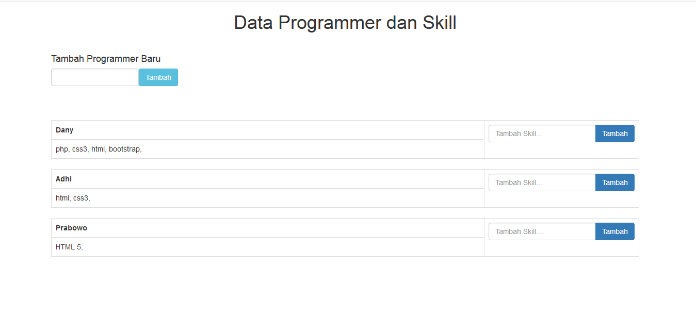
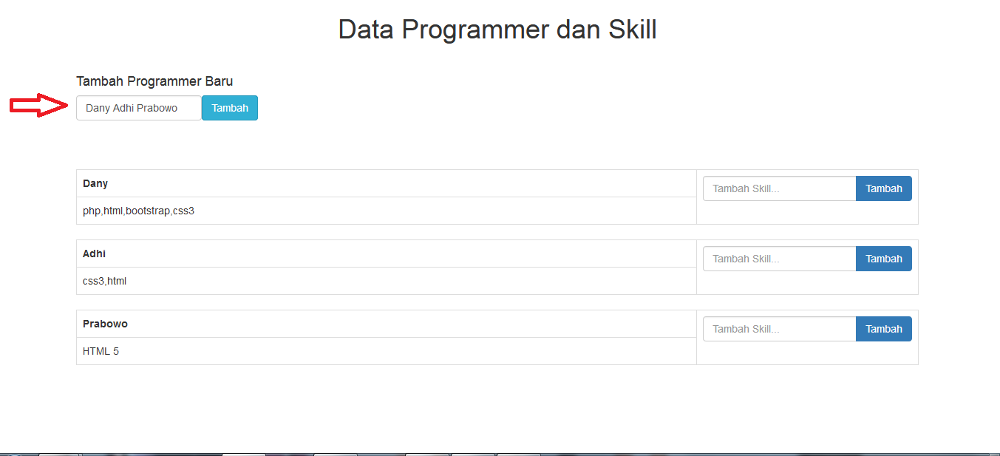
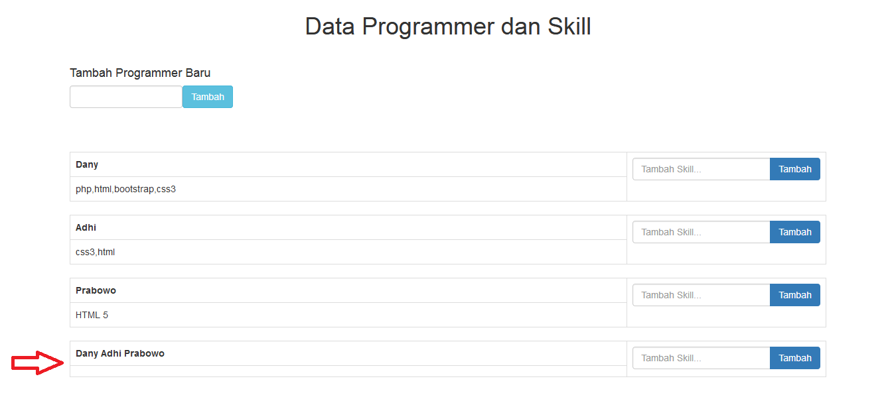
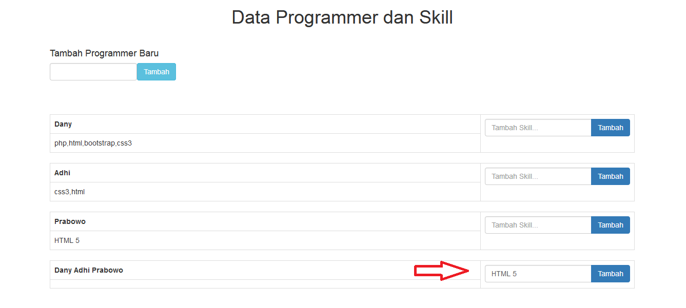
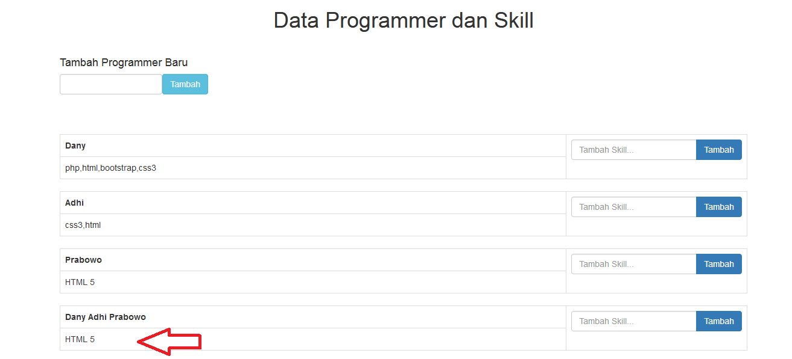

# B10K5A

Rest API adalah Gaya arsitektural yang didalamnya terdapat aturan-aturan untuk membuat web service,Arsitektur REST yang umumnya dijalankan via HTTP (Hypertext Transfer Protocol) dan method yang dapat digunakan Rest API antara lain GET, POST, PUT, DELETE.
Kegunaan Dari JSON adalah sebagai format pertukaran data dalam Rest API, kelebihan Json adalah mudah untuk ditulis dan dibaca oleh komputer, dan format pertukaran data json ini sangatlah ringan dibanding yang lain.

Tolls-tolls yang digunakan untuk menjalankan source code ini adalah : xampp dan web browser.

Demo Aplikasi Programmer:

Tampilan awal aplikasi.

Jika ingin menambah user atau programmer, tulis nama pada form input seperti dibawah ini, lalu klik tombol tambah yang berada disebelah form tersebut.

Maka otomatis nama yang kita input tadi akan bertambah pada list programmer dengan skill yang masih kosong.

Jika ingin menambah skill pada salah satu programmer, kita harus tulis skill pada form input yang berada sebelah nama yang ingin ditambah, lalu klik tombol tambah yang berada disebelah form input tersebut.

Maka otomatis skill yang kita input tadi akan bertambah pada programmer seperti gambar dibawah ini.

